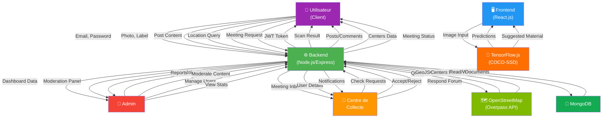

# 🎯 Diagramme de Contexte - EcoScan Recycle

## 📌 Vue d'ensemble

Le **diagramme de contexte** (Context Diagram) montre:
- **Le système central** = EcoScan Recycle (Backend + Frontend)
- **Les acteurs externes** autour
- **Les flux de données** entre eux

---

## 🎨 Diagramme de Contexte - ASCII Art

```
┌─────────────────────────────────────────────────────────────────────────────┐
│                                                                             │
│  ┌──────────────┐         ┌──────────────┐         ┌──────────────┐       │
│  │   Utilisateur│         │    Admin     │         │ Centre de    │       │
│  │   (Client)   │         │              │         │  Collecte    │       │
│  └──────┬───────┘         └──────┬───────┘         └──────┬───────┘       │
│         │                        │                        │                │
│         │ 1. Email + Password    │ 2. Role check         │ 3. Demandes    │
│         │ 2. Scan photo         │ 3. Gestion users      │    rencontre    │
│         │ 3. Crée posts         │ 4. Modération         │ 4. Acceptation  │
│         │ 4. Recherche centres  │ 5. Dashboard stats    │    demandes     │
│         │                        │                        │                │
│         └────────────┬───────────┴───────────┬───────────┘                │
│                      │                       │                             │
│         ┌────────────▼───────────────────────▼──────────┐                 │
│         │                                               │                 │
│         │         🌿 ECOSCAN RECYCLE SYSTEM 🌿         │                 │
│         │                                               │                 │
│         │  ┌──────────────────────────────────────┐   │                 │
│         │  │         FRONTEND (React.js)          │   │                 │
│         │  │  ├─ Scan Interface (TensorFlow.js)  │   │                 │
│         │  │  ├─ Forum Posts & Comments          │   │                 │
│         │  │  ├─ RecyclingCenterMap (Leaflet)   │   │                 │
│         │  │  ├─ Leaderboard                     │   │                 │
│         │  │  └─ Dashboard User                  │   │                 │
│         │  └──────────────────────────────────────┘   │                 │
│         │                                               │                 │
│         │  ┌──────────────────────────────────────┐   │                 │
│         │  │        BACKEND (Node.js/Express)    │   │                 │
│         │  │  ├─ authController                  │   │                 │
│         │  │  ├─ scanController                  │   │                 │
│         │  │  ├─ forumController                 │   │                 │
│         │  │  ├─ centerController                │   │                 │
│         │  │  └─ meetingController               │   │                 │
│         │  └──────────────────────────────────────┘   │                 │
│         │                                               │                 │
│         │  ┌──────────────────────────────────────┐   │                 │
│         │  │       DATABASE (MongoDB)            │   │                 │
│         │  │  ├─ Users                           │   │                 │
│         │  │  ├─ Scans                           │   │                 │
│         │  │  ├─ Posts & Comments                │   │                 │
│         │  │  ├─ RecyclingCenters                │   │                 │
│         │  │  └─ MeetingRequests                 │   │                 │
│         │  └──────────────────────────────────────┘   │                 │
│         │                                               │                 │
│         └───────────┬────────────────────────┬─────────┘                 │
│                     │                        │                            │
│                     │ 5. JSON data           │ 6. Centers data           │
│                     │                        │                            │
│         ┌───────────▼──────────┐   ┌────────▼───────────┐               │
│         │  TensorFlow.js       │   │  OpenStreetMap     │               │
│         │  (COCO-SSD)          │   │  (Overpass API)    │               │
│         │                      │   │                    │               │
│         │ IA Detection:        │   │ Geographic Data:   │               │
│         │ - Load model         │   │ - Centres list     │               │
│         │ - Detect objects     │   │ - Coordinates      │               │
│         │ - Suggest material   │   │ - Materials types  │               │
│         │                      │   │                    │               │
│         └──────────────────────┘   └────────────────────┘               │
│                                                                             │
└─────────────────────────────────────────────────────────────────────────────┘
```

---

## 🔄 Flux de Données Détaillés

### **1. Utilisateur ↔ EcoScan System**

```
UPSTREAM (User → System):
├─ Email + Password
│   └─ POST /api/auth/register
│   └─ POST /api/auth/login
│
├─ Photo + Label + Material
│   └─ POST /api/scans (multipart/form-data)
│
├─ Post Title + Content + Images
│   └─ POST /api/forum/posts
│
├─ Location (latitude, longitude)
│   └─ GET /api/centers/nearby?lat=X&lng=Y
│
└─ Meeting Request
    └─ POST /api/meetings

DOWNSTREAM (System → User):
├─ JWT Access + Refresh Tokens
│   └─ 200 OK { token, user }
│
├─ Scan Confirmation + Points
│   └─ 201 Created { scan, userStats }
│
├─ Posts List + Comments
│   └─ 200 OK { posts, pagination }
│
├─ Centers List + Map Data
│   └─ 200 OK { centers, coordinates }
│
└─ Meeting Status
    └─ 200 OK { meeting, status }
```

### **2. Admin ↔ EcoScan System**

```
UPSTREAM (Admin → System):
├─ Role Check
│   └─ GET /api/users/me (admin check)
│
├─ Moderation Actions
│   └─ PATCH /api/admin/posts/:id/status
│   └─ DELETE /api/admin/posts/:id
│
├─ User Management
│   └─ PATCH /api/admin/users/:id
│   └─ DELETE /api/admin/users/:id
│
└─ Data Analysis
    └─ GET /api/admin/stats

DOWNSTREAM (System → Admin):
├─ Dashboard Data
│   └─ 200 OK { stats, graphs, users }
│
├─ Moderation Panel
│   └─ 200 OK { posts, comments, reports }
│
└─ Export Data
    └─ 200 OK CSV/JSON
```

### **3. Centre de Collecte ↔ EcoScan System**

```
UPSTREAM (Centre → System):
├─ View Profile
│   └─ GET /api/users/me (centre user)
│
├─ Check Inbox
│   └─ GET /api/meetings/inbox
│
├─ Accept/Reject Meeting
│   └─ PATCH /api/meetings/:id
│       └─ { status: "accepted" | "rejected" }
│
└─ Respond in Forum
    └─ POST /api/forum/posts/:id/comments

DOWNSTREAM (System → Centre):
├─ Meeting Requests
│   └─ 200 OK { requests: [...] }
│
├─ User Details
│   └─ 200 OK { user, contactInfo }
│
└─ Confirmation + Notification
    └─ Email + UI notification
```

### **4. EcoScan System ↔ TensorFlow.js**

```
UPSTREAM (Browser → TensorFlow):
├─ Load COCO-SSD Model
│   └─ Load from CDN (~140MB)
│   └─ Cache locally
│
├─ Image Input
│   └─ Image element / Canvas
│   └─ HTMLImageElement | HTMLCanvasElement
│
└─ Run Inference
    └─ model.detect(imageElement)

DOWNSTREAM (TensorFlow → Browser):
├─ Model Loaded
│   └─ Ready signal
│
├─ Predictions
│   └─ [
│       { class: "bottle", score: 0.95, bbox: [...] },
│       { class: "cup", score: 0.87, bbox: [...] }
│      ]
│
└─ Suggested Material
    └─ { material: "plastique", confidence: 95% }
```

### **5. EcoScan System ↔ OpenStreetMap (Overpass API)**

```
UPSTREAM (Backend → Overpass):
├─ Query Request (Overpass QL)
│   └─ GET /api/centers/osm
│   └─ Query: amenity=waste_basket OR recycling
│
└─ Filter Parameters
    └─ ?bbox=south,west,north,east

DOWNSTREAM (Overpass → Backend):
├─ GeoJSON Response
│   └─ {
│       "type": "FeatureCollection",
│       "features": [
│         {
│           "geometry": { "type": "Point", "coordinates": [...] },
│           "properties": { "name", "tags", ... }
│         }
│       ]
│      }
│
└─ Error Handling
    └─ Failover à 3 endpoints
    └─ Timeout: 10 secondes
```

### **6. Backend ↔ MongoDB**

```
UPSTREAM (Express → MongoDB):
├─ CRUD Operations
│   ├─ User.findByIdAndUpdate()
│   ├─ Scan.insertOne()
│   ├─ Post.findById()
│   └─ RecyclingCenter.find()
│
├─ Queries
│   ├─ User.findOne({ email })
│   ├─ Scan.find({ userId })
│   ├─ Post.find().sort()
│   └─ RecyclingCenter.find().near()
│
└─ Transactions
    └─ Session.startTransaction()

DOWNSTREAM (MongoDB → Express):
├─ Documents
│   └─ { _id, field1, field2, ... }
│
├─ Cursor Results
│   └─ [{ doc1 }, { doc2 }, ...]
│
├─ Aggregation
│   └─ $group, $sort, $limit
│
└─ Error/Success
    └─ Promise.resolve() / Promise.reject()
```

---

## 📊 Mermaid Diagram - Context



---

## 📋 Matrice d'Interactions - Contexte

### **Acteurs vs Données**

```
                    │ User │ Admin │ Centre │ TF │ OSM │ DB
────────────────────┼──────┼───────┼────────┼────┼─────┼────
Email/Password      │  ✓   │   ✓   │   ✓    │ -  │  -  │ ✓
Photo + Label       │  ✓   │   -   │   -    │ ✓  │  -  │ ✓
Post Content        │  ✓   │   ✓   │   ✓    │ -  │  -  │ ✓
Location Data       │  ✓   │   -   │   -    │ -  │  ✓  │ -
Meeting Request     │  ✓   │   -   │   ✓    │ -  │  -  │ ✓
JWT Token           │  ✓   │   ✓   │   ✓    │ -  │  -  │ -
Scan Result         │  ✓   │   -   │   -    │ -  │  -  │ ✓
Centers GeoData     │  ✓   │   -   │   -    │ -  │  ✓  │ ✓
Admin Stats         │  -   │   ✓   │   -    │ -  │  -  │ ✓
Predictions         │  ✓   │   -   │   -    │ ✓  │  -  │ -

Legend: ✓ = Interaction, - = No interaction
```

---

## 🔐 Frontières du Système

### **Intérieur du Système (EcoScan)**
```
✅ Frontend (React)
   ├─ Scan.js - Interface scanning
   ├─ Forum.js - Forum posts
   ├─ RecyclingCenterMap.js - Carte
   ├─ AuthContext.js - Authentication
   └─ Dashboard.js - User dashboard

✅ Backend (Node.js/Express)
   ├─ Controllers (6)
   ├─ Models (6)
   ├─ Routes (6)
   ├─ Middleware (auth)
   └─ Utils (helpers, tokenManager)

✅ Database (MongoDB)
   ├─ Users Collection
   ├─ Scans Collection
   ├─ Posts Collection
   ├─ Comments Collection
   ├─ RecyclingCenters Collection
   └─ MeetingRequests Collection
```

### **Extérieur du Système (Acteurs & APIs)**
```
🔴 ACTEURS HUMAINS
├─ Utilisateurs (Clients)
├─ Administrateurs
└─ Centres de Collecte

🔴 SYSTÈMES EXTERNES
├─ TensorFlow.js (CDN)
├─ OpenStreetMap Overpass API
├─ Browser APIs (navigator.mediaDevices, geolocation)
└─ Optionnel: Email service, Payment gateway
```

### **Frontières définies**
```
┌─────────────────────────────────────┐
│  EcoScan System Boundary            │
│                                     │
│  ┌───────────────────────────────┐ │
│  │  Frontend (React + TensorFlow)│ │
│  └───────────┬───────────────────┘ │
│              │                      │
│  ┌───────────▼───────────────────┐ │
│  │  Backend (Express + Mongoose) │ │
│  └───────────┬───────────────────┘ │
│              │                      │
│  ┌───────────▼───────────────────┐ │
│  │  Database (MongoDB)           │ │
│  └───────────────────────────────┘ │
└──────────────┬────────────────────┘
               │
    ┌──────────┼──────────┐
    │          │          │
   Users   Admins    Centers
    │          │          │
    └──────────┼──────────┘
               │
    ┌──────────┴───────────┐
    │                      │
TensorFlow.js        OpenStreetMap
(COCO-SSD)          (Overpass API)
```

---

## 🌐 Protocoles de Communication

### **Internes (Intra-système)**

```
Frontend ↔ Backend
├─ Protocol: HTTP/HTTPS + REST
├─ Format: JSON
├─ Authentication: JWT Bearer Token
├─ Methods: GET, POST, PUT, DELETE, PATCH
└─ Endpoints: /api/*

Backend ↔ Database
├─ Protocol: MongoDB Wire Protocol
├─ Format: BSON
├─ Authentication: Connection String + Credentials
├─ Methods: find, insertOne, updateOne, etc.
└─ Library: Mongoose ODM

Frontend ↔ TensorFlow.js
├─ Protocol: In-memory / Local
├─ Format: JavaScript objects
├─ Authentication: N/A (local execution)
├─ Methods: loadModel(), detect(), inference
└─ Library: TensorFlow.js
```

### **Externes (Sortants)**

```
Backend ↔ OpenStreetMap API
├─ Protocol: HTTP/HTTPS
├─ Format: GeoJSON
├─ Authentication: No auth required
├─ Methods: GET
├─ Endpoint: https://overpass-api.de/api/interpreter
└─ Query Language: Overpass QL

Browser ↔ TensorFlow.js CDN
├─ Protocol: HTTPS
├─ Format: .js files + .bin weights
├─ Authentication: No auth required
├─ Methods: GET
└─ URL: https://cdn.jsdelivr.net/npm/@tensorflow-models/coco-ssd

Browser ↔ Device APIs
├─ Protocol: JavaScript WebAPI
├─ Methods: 
│   ├─ navigator.mediaDevices.getUserMedia() → Camera
│   ├─ navigator.geolocation.getCurrentPosition() → Location
│   └─ localStorage.setItem() → Local Storage
└─ Authentication: User permission required
```

---

## 📡 Cas d'Usage de Flux de Données

### **Cas 1: Scanner un Objet**

```
User (Physical Action)
    ↓
[Take photo with camera]
    ↓
Frontend (React)
    ├─ 📸 Capture image
    ├─ 🤖 Load TensorFlow model
    ├─ 🔍 Run detection
    └─ 💡 Suggest material
    ↓
[User validates and submits]
    ↓
Frontend → Backend
    ├─ POST /api/scans
    ├─ Multipart: photo, label, material
    ├─ Header: Authorization: Bearer JWT
    └─ Content-Type: multipart/form-data
    ↓
Backend (Express)
    ├─ ✓ Validate JWT
    ├─ 📁 Upload file (Multer)
    ├─ 📝 Validate data
    ├─ 🔢 Lookup points
    └─ 💾 Save to MongoDB
    ↓
MongoDB
    ├─ Create Scan document
    └─ Update User.points
    ↓
Backend → Frontend
    ├─ 201 Created
    ├─ { scan, userStats, points }
    └─ Content-Type: application/json
    ↓
Frontend (React)
    ├─ ✅ Show success message
    ├─ 📊 Update leaderboard
    └─ 🎉 Display "+10 points"
    ↓
User (Happy!)
```

### **Cas 2: Chercher les Centres Proches**

```
User (Mobile)
    ↓
[Click "Find nearby centers"]
    ↓
Frontend (React)
    ├─ 📍 Get geolocation
    ├─ navigator.geolocation.getCurrentPosition()
    └─ Get: latitude, longitude
    ↓
Frontend → Backend
    ├─ GET /api/centers/nearby?lat=36.8&lng=10.16
    ├─ Header: Authorization: Bearer JWT (optional)
    └─ Params: latitude, longitude, radius
    ↓
Backend (Express)
    ├─ ✓ Validate params
    ├─ 📊 Query MongoDB
    ├─ 🔢 Calculate Haversine distance
    ├─ 📊 Filter by material (optional)
    └─ 📈 Sort by distance (ascending)
    ↓
MongoDB
    ├─ Find all RecyclingCenters
    └─ Return: name, coords, materials, phone
    ↓
Backend → Frontend
    ├─ 200 OK
    ├─ { centers: [...], pagination }
    └─ Content-Type: application/json
    ↓
Frontend (React)
    ├─ 🗺️ Initialize Leaflet map
    ├─ 🧭 Center on user location
    ├─ 📍 Add markers for each center
    └─ 🎯 Custom icons + popups
    ↓
Frontend ↔ OpenStreetMap
    ├─ GET tile layer from OSM
    └─ Render map with tiles
    ↓
User (Sees map!)
```

### **Cas 3: Modération Admin**

```
Moderator (Admin)
    ↓
[Opens Admin Dashboard]
    ↓
Frontend (React)
    ├─ Check role from localStorage
    └─ Show admin-only components
    ↓
Frontend → Backend
    ├─ GET /api/admin/posts
    ├─ Header: Authorization: Bearer JWT (admin token)
    └─ Query: ?status=reported
    ↓
Backend (Express)
    ├─ ✓ Validate JWT
    ├─ ✓ Check role === "admin"
    ├─ 📊 Query MongoDB
    └─ Filter: status="reported" OR status="published"
    ↓
MongoDB
    ├─ Find Posts collection
    └─ Return: title, content, author, status, date
    ↓
Backend → Frontend
    ├─ 200 OK
    ├─ { posts: [...] }
    └─ Content-Type: application/json
    ↓
Frontend (React)
    ├─ Display reported posts
    ├─ Show action buttons
    └─ [Hide] [Delete] [Approve]
    ↓
[Admin clicks "Hide"]
    ↓
Frontend → Backend
    ├─ PATCH /api/admin/posts/:id/status
    ├─ Header: Authorization: Bearer JWT
    └─ Body: { status: "hidden", reason: "Spam" }
    ↓
Backend (Express)
    ├─ ✓ Validate JWT + Admin role
    ├─ 📝 Validate status value
    ├─ 📊 Update MongoDB
    └─ Send notification to post author
    ↓
MongoDB
    ├─ Update Post.status = "hidden"
    └─ Update Post.moderatedBy = adminId
    ↓
Backend → Frontend
    ├─ 200 OK
    ├─ { post, message: "Post hidden" }
    └─ Content-Type: application/json
    ↓
Frontend (React)
    ├─ Remove post from list
    ├─ Show success message
    └─ Refresh posts list
    ↓
Forum Users
    ├─ Post no longer visible
    └─ (Post automatically hidden from forum)
```

---

## 🔑 Points d'Entrée (Endpoints)

```
PUBLIC (No Auth)
├─ GET /api/centers (list all)
├─ GET /api/centers/nearby (search by location)
├─ GET /api/forum/posts (read posts)
└─ POST /api/auth/register (new user)

AUTHENTICATED (JWT Required)
├─ GET /api/users/me
├─ PATCH /api/users/me
├─ POST /api/scans (create)
├─ GET /api/scans/my (own scans)
├─ POST /api/forum/posts (create post)
├─ POST /api/meetings (request meeting)
└─ GET /api/meetings/my (check status)

ADMIN ONLY (Admin Role Required)
├─ GET /api/admin/stats
├─ GET /api/admin/posts
├─ PATCH /api/admin/posts/:id/status
├─ DELETE /api/admin/posts/:id
├─ POST /api/admin/centers
├─ DELETE /api/admin/centers/:id
└─ PATCH /api/admin/users/:id

MODERATOR ONLY
├─ GET /api/admin/posts (reported)
├─ PATCH /api/admin/posts/:id/status (hide)
└─ DELETE /api/admin/posts/:id/comments/:cId
```

---

## 🎯 Résumé: Frontières Claires

```
DEDANS (EcoScan System Responsibility)
✅ User authentication & authorization
✅ Scan creation & storage
✅ Forum posts & comments
✅ Meeting management
✅ Points calculation
✅ Database operations
✅ API endpoints
✅ Error handling

DEHORS (External Systems)
🔴 TensorFlow.js model (CDN)
🔴 OpenStreetMap data (Overpass API)
🔴 Browser APIs (camera, geolocation)
🔴 Email service (optional)
🔴 Payment gateway (future)
🔴 Social media integration (future)

INTERFACE POINTS (Data Exchange)
🌉 Frontend ↔ Backend: REST API (JSON)
🌉 Backend ↔ Database: MongoDB (BSON)
🌉 Frontend ↔ TensorFlow: JavaScript (in-memory)
🌉 Backend ↔ OpenStreetMap: HTTP (GeoJSON)
🌉 All ↔ Users: HTTP/HTTPS + WebSocket (future)
```

---

**Diagramme de contexte complet pour EcoScan! 🎯**
