# 📊 Diagrammes d'Activité - Système de Scanning

> Trois diagrammes d'activité détaillés pour les workflows clés du scanning EcoScan

---

## 📱 Diagramme 1: Scanner un Objet

### Description
Le workflow complet pour capturer une photo, détecter l'objet avec IA, et sauvegarder le scan.

### Étapes Principales

#### Phase 1️⃣: Sélection Source (Caméra vs Upload)
```
┌─ Accès Scan.js
├─ Choisir caméra OU fichier
├─ Caméra: ouvrir flux streaming
└─ Upload: sélectionner fichier local
```

#### Phase 2️⃣: Capture Photo
```
Caméra:
├─ Afficher aperçu streaming
├─ Boucle: afficher flux
└─ Clic: capturer frame

Upload:
├─ Sélectionner fichier
└─ Afficher aperçu
```

#### Phase 3️⃣: Confirmation Photo
```
├─ Afficher aperçu
├─ Boutons: Retake / Confirm
├─ Si Retake → revenir au début
└─ Si Confirm → TensorFlow.js
```

#### Phase 4️⃣: Détection IA (TensorFlow.js)
```
├─ loadModel() → charger COCO-SSD
├─ Attendre modèle (<3 sec)
├─ detectObjects() → prédictions
├─ Filter: confidence > 50%
└─ suggestMaterial() → proposer matériau
```

#### Phase 5️⃣: Affichage Résultats
```
├─ Afficher ScanResult.js
├─ Bounding boxes autour objets
├─ Confidence scores
├─ Material auto-rempli
└─ Form éditable (label + material)
```

#### Phase 6️⃣: Validation & Upload
```
├─ Valider données (label + material)
├─ Si non valides → afficher erreurs
├─ Si valides → POST /api/scans
├─ Multer upload photo
├─ Sauvegarder en MongoDB
└─ Redirection historique (succès!)
```

### Points Clés
- ✅ **TensorFlow côté client:** Aucun appel réseau pour IA
- ✅ **Fallback:** Si confiance < 50%, saisie manuelle
- ✅ **Validation serveur:** Vérifier label + material valides
- ✅ **Erreur handling:** Retry upload si échec

### Durée Attendue
- Flux caméra: 5-10 secondes
- Détection IA: <100ms
- Upload: 1-3 secondes
- **Total:** 10-15 secondes

---

## 📚 Diagramme 2: Consulter Historique

### Description
Le workflow pour afficher tous les scans de l'utilisateur avec pagination.

### Étapes Principales

#### Phase 1️⃣: Accès & Authentification
```
├─ Utilisateur clique "Historique"
├─ Vérifier JWT token en localStorage
├─ Si expiré → redirection Connexion
└─ Si valide → continuer
```

#### Phase 2️⃣: Requête Backend
```
├─ Frontend envoie: GET /api/scans/my?page=1&limit=10
├─ Backend reçoit requête
├─ authMiddleware: vérifier JWT
├─ Extraire userId du token
└─ Query MongoDB: Scan.find({userId})
```

#### Phase 3️⃣: Récupération & Tri
```
├─ Rechercher tous les scans de l'utilisateur
├─ Trier par createdAt (récent d'abord)
├─ Appliquer pagination: skip=(page-1)*10, limit=10
├─ Résultat: Array de 10 scans
└─ Response 200 avec JSON
```

#### Phase 4️⃣: Gestion Cas Vides
```
Si 0 scans:
├─ Afficher message "Aucun scan encore"
├─ Afficher bouton "Faire mon premier scan"
└─ Inciter utilisateur

Si scans trouvés:
├─ Afficher liste
└─ Continuer...
```

#### Phase 5️⃣: Affichage Liste
```
├─ Boucle: map(scans)
├─ Afficher pour chaque scan:
│  ├─ Miniature photo
│  ├─ Label de l'objet
│  ├─ Matériau détecté
│  ├─ Points gagnés
│  ├─ Date/Heure
│  └─ "Il y a X jours"
└─ Tous les scans visibles
```

#### Phase 6️⃣: Pagination
```
├─ Compter total scans
├─ Si plus de 10 scans:
│  ├─ Afficher bouton "Charger plus"
│  └─ Clic → GET /api/scans/my?page=2
├─ Si tous chargés:
│  └─ Bouton disabled
└─ Boucle infinie possible
```

### Points Clés
- ✅ **Authentification:** JWT obligatoire
- ✅ **Pagination:** 10 items par page (évite surcharge)
- ✅ **Tri:** Récent d'abord (createdAt DESC)
- ✅ **Performance:** Lean queries (sans populate si possible)

### Durée Attendue
- Requête API: <200ms
- Rendu UI: <500ms
- **Total:** ~700ms pour 10 scans

### Données Affichées
```javascript
{
  _id: "...",
  userId: "...",
  label: "Bouteille plastique",
  material: "Plastic",
  points: 7,
  photoUrl: "/uploads/...",
  createdAt: "2026-05-25T14:30:00Z"
}
```

---

## 🎯 Diagramme 3: Gagner des Points

### Description
Le workflow complet pour calculer, attribuer et afficher les points gagnés.

### Étapes Principales

#### Phase 1️⃣: Réception Scan
```
├─ Backend reçoit POST /api/scans
├─ Données: photo, label, material
├─ Valider label + material
└─ Si invalides → Erreur 400
```

#### Phase 2️⃣: Upload & Sauvegarde
```
├─ Multer upload photo
├─ Vérifier fichier valide (5MB, jpeg/png/webp)
├─ Sauvegarder dans /uploads
└─ Si erreur → Erreur 500
```

#### Phase 3️⃣: Créer Document Scan
```
├─ Créer Scan document MongoDB:
│  ├─ userId: from token
│  ├─ label: from form
│  ├─ material: from form
│  ├─ photoUrl: path du fichier
│  └─ createdAt: Date.now()
└─ Document créé
```

#### Phase 4️⃣: 📊 CALCUL POINTS (Le Cœur!)
```
1️⃣ Lookup matériau:
   └─ Chercher dans MATERIAL_DATABASE
   
2️⃣ Déterminer points de base:
   ├─ Plastique = 5 points
   ├─ Papier = 3 points
   ├─ Métal = 8 points
   ├─ Verre = 6 points
   └─ Matériau inconnu = 5 (par défaut)

3️⃣ Bonus pour confiance IA:
   ├─ Si TensorFlow confiance > 80%:
   │  ├─ +2 bonus points
   │  └─ Détection fiable
   └─ Si confiance < 80%:
      └─ Pas de bonus

4️⃣ Points Totaux:
   └─ points_totaux = base + bonus
   └─ Exemple: 5 + 2 = 7 points
```

#### Phase 5️⃣: Mise à Jour User
```
├─ Récupérer User document
├─ Lire User.points (ancien total)
├─ Incrémenter: User.points += pointsGagnés
├─ Sauvegarder en MongoDB
├─ Si erreur → Rollback & Erreur 500
└─ Si ok → Sauvegarde confirmée
```

#### Phase 6️⃣: Response Frontend
```
├─ Response 201 Created
├─ Retourner:
│  ├─ Scan details
│  ├─ Points gagnés
│  └─ Total points utilisateur
└─ Frontend reçoit JSON
```

#### Phase 7️⃣: Affichage & Notification
```
├─ Frontend reçoit réponse
├─ 🎉 Afficher notification: "Succès! +7 points"
├─ Animation: points gagnés en évidence
└─ Sons optionnels: notification
```

#### Phase 8️⃣: Mise à Jour UI
```
├─ Afficher points gagnés (cette session: +7)
├─ Afficher total cumulé (user.points)
├─ Mettre à jour profil
├─ Mettre à jour dashboard
└─ Historique se refresh automatiquement
```

#### Phase 9️⃣: Progression Globale
```
├─ Points visibles sur:
│  ├─ Profil utilisateur
│  ├─ Dashboard
│  └─ Leaderboard (ranking mis à jour)
├─ Si montée au classement:
│  └─ Notification bonus!
└─ Utilisateur motivé pour prochains scans
```

### Table Points par Matériau

```
┌──────────────────┬────────┬────────────┐
│ Matériau         │ Points │ + Bonus    │
├──────────────────┼────────┼────────────┤
│ Plastique        │   5    │ +2 (conf>80)
│ Papier           │   3    │ +2         │
│ Métal            │   8    │ +2         │
│ Verre            │   6    │ +2         │
│ Bois             │   4    │ +2         │
│ Textile          │   4    │ +2         │
│ Électronique     │  10    │ +3 (bonus+) │
│ Inconnu/Défaut   │   5    │ +0         │
└──────────────────┴────────┴────────────┘
```

### Points Clés
- ✅ **Atomicité:** Scan créé ET points attribués ensemble
- ✅ **Bonus IA:** Encourage bonnes détections
- ✅ **Transparence:** Utilisateur voit tous points
- ✅ **Motivation:** Points visibles immédiatement

### Durée Attendue
- Calcul points: <50ms
- Mise à jour DB: <100ms
- **Total:** ~150ms

### Gamification Éléments
```
🎯 Mécaniques addictives:
├─ Notification immédiate (+X points)
├─ Son satisfaction (optionnel)
├─ Animation points (bounce)
├─ Ranking visible (compétition)
├─ Progression visible (bar)
└─ Badges futur (100 scans = badge 🏆)
```

---

## 🔄 Interaction Entre Workflows

```
Scanner un Objet
       ↓
    Créer Scan
       ↓
   Gagner Points
       ↓
  (Automatique!)
       ↓
Consulter Historique
       ↓
  Voir points gagnés
       ↓
  Voir ranking
       ↓
  Motivation pour prochains!
```

---

## ⚠️ Erreurs & Edge Cases

### Scanner un Objet
| Cas | Handling |
|-----|----------|
| Modèle TensorFlow non chargé | Afficher erreur, proposer retry |
| Confidence < 50% | Saisie manuelle du matériau |
| Upload échoue | Retry automatique (3x) |
| Validation échoue | Afficher erreurs, permettre correction |

### Consulter Historique
| Cas | Handling |
|-----|----------|
| Pas authentifié | Redirection login |
| Aucun scan | Message bienveillant + CTA |
| Pagination invalide | Retour page 1 |
| DB down | Erreur 500 + retry possible |

### Gagner Points
| Cas | Handling |
|-----|----------|
| User.points overflow | Logique: pas de max (gamification) |
| Matériau inconnu | Points par défaut (5) |
| IA confiance invalide | Pas de bonus (sécurité) |
| Transaction échoue | Rollback complet (atomicité) |

---

## 📈 Métriques à Tracker

### Performance
- ⏱️ Temps scanner: 10-15 sec (acceptable)
- ⏱️ Temps historique: <1 sec (bon)
- ⏱️ Temps points: ~150ms (excellent)

### Usage
- 📊 Scans par utilisateur (target: 5+/semaine)
- 📊 Points gagnés (total cumulé)
- 📊 Utilisateurs actifs (DAU)
- 📊 Matériau le plus scanné

### Satisfaction
- ⭐ Confiance TensorFlow (>80% = bon)
- ⭐ Error rate (target: <5%)
- ⭐ Completion rate (scanner → historique)

---

## 🏗️ Diagramme de Classe - Sprint 2

### Vue d'Ensemble des Classes

Le sprint de scanning utilise **8 classes principales** pour gérer le workflow complet.

### Classes Détaillées

#### 1. **User** (Modèle)
```javascript
Responsabilités:
├─ Stocker données utilisateur
├─ Gérer authentification
└─ Tracker les points

Attributs Clés:
├─ email: string (unique)
├─ passwordHash: string (bcryptjs)
├─ points: number (scoring)
├─ role: enum (user|moderator|admin)
└─ avatar: string (optionnel)

Méthodes:
├─ getProfile(): retourne données publiques
├─ updateProfile(data): mise à jour infos
├─ incrementPoints(amount): +points gagnés
└─ verifyPassword(pwd): valider mot de passe
```

**Collection MongoDB:**
```javascript
{
  _id: ObjectId,
  email: "user@example.com",
  firstName: "John",
  lastName: "Doe",
  passwordHash: "$2b$12$...",
  points: 42,
  role: "user",
  avatar: "/avatars/user123.jpg",
  createdAt: ISODate("2026-05-25T10:00:00Z"),
  updatedAt: ISODate("2026-05-25T10:00:00Z")
}
```

---

#### 2. **Scan** (Modèle)
```javascript
Responsabilités:
├─ Enregistrer chaque scan
├─ Stocker résultats IA
└─ Tracker points gagnés

Attributs Clés:
├─ userId: ObjectId (référence User)
├─ label: string (objet scanné)
├─ material: string (plastique, papier, etc)
├─ points: number (gagnés)
├─ photoUrl: string (chemin fichier)
├─ confidence: number (confiance IA 0-1)
└─ detections: Array (prédictions brutes)

Méthodes:
├─ create(): crée un nouveau scan
├─ findByUserId(userId, page, limit): récupère historique
├─ delete(): supprime un scan
└─ getStats(userId): stats utilisateur
```

**Collection MongoDB:**
```javascript
{
  _id: ObjectId,
  userId: ObjectId("507f1f77bcf86cd799439011"),
  label: "Bouteille plastique",
  material: "Plastic",
  points: 7,
  photoUrl: "/uploads/scan_12345.jpg",
  confidence: 0.89,
  detections: [
    { class: "bottle", confidence: 0.89, bbox: [...] }
  ],
  createdAt: ISODate("2026-05-25T14:30:00Z"),
  updatedAt: ISODate("2026-05-25T14:30:00Z")
}
```

**Indexes:**
```javascript
db.scans.createIndex({ userId: 1, createdAt: -1 })
db.scans.createIndex({ createdAt: -1 })
db.scans.createIndex({ material: 1 })
```

---

#### 3. **scanController** (Contrôleur)
```javascript
Responsabilités:
├─ Gérer flux scan (POST, GET)
├─ Orchestrer TensorFlow + Upload
├─ Calculer points
└─ Valider données

Dépendances:
├─ Scan model
├─ User model
├─ tensorflowUtils
├─ authMiddleware
├─ Multer (file upload)
└─ MATERIAL_DATABASE

Méthodes Publiques:
├─ createScan(req, res):
│  ├─ Valider données
│  ├─ Upload photo (Multer)
│  ├─ Créer document Scan
│  ├─ Incrémenter User.points
│  └─ Response 201
│
├─ getMyScans(req, res):
│  ├─ Récupérer userId du token
│  ├─ Query Scan.find({userId})
│  ├─ Pagination (page, limit)
│  └─ Response 200 avec array
│
├─ getScan(scanId, req, res):
│  ├─ Récupérer 1 scan
│  ├─ Vérifier propriété (userId)
│  └─ Response 200
│
└─ deleteScan(scanId, req, res):
   ├─ Vérifier propriété
   ├─ Supprimer Scan
   └─ Response 200

Méthodes Privées:
├─ uploadPhoto(file): string
│  ├─ Vérifier fichier (5MB, jpeg/png/webp)
│  ├─ Sauvegarder dans /uploads
│  └─ Retourner photoUrl
│
├─ validateScanData(label, material): boolean
│  ├─ Label: string non vide
│  ├─ Material: valid enum
│  └─ Retourner true/false
│
└─ calculatePoints(material, confidence): number
   ├─ Lookup MATERIAL_DATABASE
   ├─ Points base du matériau
   ├─ +Bonus si confidence > 80%
   └─ Retourner total
```

---

#### 4. **tensorflowUtils** (Utilitaire IA)
```javascript
Responsabilités:
├─ Charger modèle COCO-SSD
├─ Détecter objets dans images
├─ Proposer matériau
└─ Gérer cache modèle

État:
├─ model: null | TensorFlow model
└─ isModelLoaded: boolean

Méthodes Publiques:
├─ loadModel(): Promise<Object>
│  ├─ Vérifier si déjà chargé
│  ├─ Charger COCO-SSD depuis CDN
│  ├─ Cacher en localStorage
│  └─ Retourner model
│
├─ detectObjects(image): Promise<Array>
│  ├─ Convertir image en tensor
│  ├─ Passer à model.detect()
│  ├─ Filter confidence > 50%
│  └─ Retourner [{ class, confidence, bbox }, ...]
│
└─ suggestMaterial(detections): string
   ├─ Prendre première détection
   ├─ mapper class → matériau
   └─ Retourner "Plastic" | "Paper" | ...

Méthodes Privées:
├─ filterByConfidence(detections, threshold): Array
│  ├─ Filter detections.confidence >= threshold
│  └─ Retourner filtered array
│
├─ mapDetectionToMaterial(className): string
│  ├─ bottle → "Plastic"
│  ├─ newspaper → "Paper"
│  ├─ can → "Metal"
│  └─ ...
│
└─ cacheModel(model): void
   └─ Sauvegarder en localStorage.ecoscan_tfmodel
```

**Modèle Pré-entraîné:**
- COCO-SSD (80 classes)
- Taille: ~100MB (chargé une fois)
- Cache: localStorage (réutilisable)
- Latence: <100ms par détection

---

#### 5. **authMiddleware** (Middleware)
```javascript
Responsabilités:
├─ Vérifier JWT token
├─ Extraire userId
├─ Protéger routes
└─ Gérer token expiré

Méthodes:
├─ verify(req, res, next): void
│  ├─ Extraire token du header Authorization
│  ├─ Valider format "Bearer <token>"
│  ├─ Appel validateToken()
│  ├─ Si ok: req.user = decoded, next()
│  └─ Si erreur: res.status(401)
│
├─ extractToken(req): string
│  └─ Récupérer token depuis "Authorization: Bearer <token>"
│
└─ Privé validateToken(token): Object
   ├─ Appel TokenManager.validate()
   ├─ Vérifier signature
   ├─ Vérifier expiry
   └─ Retourner payload decoded
```

**Utilisation:**
```javascript
// Dans scanRoutes.js
router.post('/scans', authMiddleware.verify, scanController.createScan)
```

---

#### 6. **Multer** (Upload)
```javascript
Responsabilités:
├─ Valider fichier
├─ Sauvegarder sur disque
└─ Gérer limites

Configuration:
├─ dest: './backend/api/uploads'
├─ limits: {
│  └─ fileSize: 5 * 1024 * 1024 (5MB)
│  }
└─ fileFilter: (req, file, cb)

Méthodes:
├─ single(fieldName): middleware
│  └─ Accepte 1 fichier du form
│
├─ validateFile(file): boolean
│  ├─ Vérifier taille
│  ├─ Vérifier MIME type
│  └─ Retourner true/false
│
├─ checkFileSize(size): boolean
│  └─ size <= 5MB
│
└─ checkMimeType(mime): boolean
   └─ mime in ['image/jpeg', 'image/png', 'image/webp']
```

**Utilisation:**
```javascript
const upload = multer({
  dest: './uploads',
  limits: { fileSize: 5 * 1024 * 1024 },
  fileFilter: (req, file, cb) => {
    if (validateFile(file)) {
      cb(null, true)
    } else {
      cb(new Error('Invalid file'))
    }
  }
})

router.post('/scans', authMiddleware, upload.single('photo'), createScan)
```

---

#### 7. **MATERIAL_DATABASE** (Lookup Table)
```javascript
Responsabilités:
├─ Mapper matériau → points
├─ Valider matériau
└─ Gérer équivalences

Données:
├─ Plastique: 5 points
├─ Papier: 3 points
├─ Métal: 8 points
├─ Verre: 6 points
├─ Bois: 4 points
├─ Textile: 4 points
├─ Électronique: 10 points
└─ Défaut: 5 points

Méthodes:
├─ getPoints(material): number
│  └─ Retourner points pour matériau
│
├─ isMaterialValid(material): boolean
│  └─ Vérifier si matériau existe
│
├─ getAllMaterials(): Array
│  └─ Retourner liste tous matériaux
│
└─ getMaterialGroup(material): string
   ├─ "bottle" → "Plastic"
   ├─ "newspaper" → "Paper"
   └─ ...
```

**Implémentation:**
```javascript
const MATERIAL_DATABASE = {
  materials: {
    'Plastic': { points: 5, icons: ['bottle', 'bag', 'cup'] },
    'Paper': { points: 3, icons: ['newspaper', 'cardboard'] },
    'Metal': { points: 8, icons: ['can', 'tin'] },
    'Glass': { points: 6, icons: ['bottle', 'jar'] },
    // ...
  },
  
  getPoints(material) {
    return this.materials[material]?.points ?? 5
  }
}
```

---

#### 8. **TokenManager** (Token Utility)
```javascript
Responsabilités:
├─ Créer JWT tokens
├─ Valider tokens
├─ Gérer refresh tokens
└─ Gérer expiry

Attributs Privés:
├─ accessSecret: string (24h aléatoire)
├─ refreshSecret: string (256b aléatoire)
└─ accessExpiry: "15m"
└─ refreshExpiry: "7d"

Méthodes:
├─ issue(userId, role): Object
│  ├─ Créer payload: { userId, role, iat, exp }
│  ├─ Signer avec accessSecret
│  ├─ Retourner:
│  │  ├─ accessToken (15 minutes)
│  │  ├─ refreshToken (7 jours)
│  │  └─ expiresIn
│
├─ refresh(refreshToken): string
│  ├─ Valider refreshToken
│  ├─ Créer nouveau accessToken
│  └─ Retourner nouvel access token
│
├─ validate(token): Object
│  ├─ Vérifier signature
│  ├─ Vérifier expiry
│  ├─ Retourner payload decoded
│  └─ Throw si invalide
│
└─ Privé decodeToken(token): Object
   └─ jwt.verify(token, secret)
```

---

### Relations Entre Classes

```
┌─────────────────────────────────────────┐
│          POST /api/scans                │
│  (Frontend envoie photo + label)        │
└──────────────────┬──────────────────────┘
                   │
                   ▼
        ┌──────────────────┐
        │ authMiddleware   │ ◄─── vérifie JWT
        │ .verify()        │
        └────────┬─────────┘
                 │ (req.user = userId)
                 ▼
      ┌──────────────────────┐
      │ Multer               │
      │ .single('photo')     │ ◄─── upload fichier
      └────────┬─────────────┘
               │ (file.path)
               ▼
     ┌──────────────────────────┐
     │ scanController           │
     │ .createScan()            │
     └────────┬─────────────────┘
              │
              ├─► User.incrementPoints()
              │
              ├─► Scan.create()
              │   ├─ userId
              │   ├─ label
              │   ├─ material
              │   ├─ photoUrl (from Multer)
              │   └─ points (calculés)
              │
              ├─► MATERIAL_DATABASE.getPoints()
              │   (lookup points du matériau)
              │
              └─► Response 201 Created
```

---

### Architecture Couches

```
┌─────────────────────────────────────────┐
│         FRONTEND (React)                 │
│  Scan.js + ScanResult.js                │
│  tensorflowUtils.js (TensorFlow.js)     │
└──────────────────┬──────────────────────┘
                   │ HTTP
                   ▼
┌─────────────────────────────────────────┐
│    API LAYER (Express)                  │
│  scanController.js                      │
│  authMiddleware.js                      │
│  Multer middleware                      │
└──────────────────┬──────────────────────┘
                   │
                   ▼
┌─────────────────────────────────────────┐
│    BUSINESS LOGIC                       │
│  MATERIAL_DATABASE                      │
│  TokenManager                           │
│  calculatePoints()                      │
└──────────────────┬──────────────────────┘
                   │
                   ▼
┌─────────────────────────────────────────┐
│    DATA ACCESS LAYER                    │
│  Scan.model.js                          │
│  User.model.js                          │
└──────────────────┬──────────────────────┘
                   │
                   ▼
┌─────────────────────────────────────────┐
│    DATABASE (MongoDB)                   │
│  scans collection                       │
│  users collection                       │
└─────────────────────────────────────────┘
```

---

### Dépendances NPM (Sprint 2)

```json
{
  "dependencies": {
    "express": "^4.18.0",
    "mongoose": "^7.0.0",
    "multer": "^1.4.5",
    "bcryptjs": "^2.4.3",
    "jsonwebtoken": "^9.0.0",
    "dotenv": "^16.0.0",
    "cors": "^2.8.5",
    "morgan": "^1.10.0"
  },
  "devDependencies": {
    "nodemon": "^2.0.20"
  },
  "frontend-dependencies": {
    "@tensorflow/tfjs": "^3.21.0",
    "@tensorflow-models/coco-ssd": "^2.2.3",
    "react": "^19.0.0",
    "react-router-dom": "^6.0.0",
    "axios": "^1.4.0"
  }
}
```

---

### Flux Complet Requête

```
1. Frontend: scanner photo
   └─ TensorFlow.js détecte objet (côté client)

2. Frontend: POST /api/scans
   Payload:
   {
     photo: <File>,
     label: "Bouteille",
     material: "Plastic",
     confidence: 0.89
   }

3. authMiddleware.verify()
   └─ Extrait userId du JWT token

4. Multer.single('photo')
   └─ Upload et sauvegarde fichier

5. scanController.createScan()
   ├─ validateScanData(label, material)
   ├─ calculatePoints("Plastic", 0.89)
   │  ├─ MATERIAL_DATABASE.getPoints("Plastic") → 5
   │  ├─ 0.89 > 0.80 → +2 bonus
   │  └─ Total: 7 points
   │
   ├─ Scan.create({
   │    userId: req.user.id,
   │    label: "Bouteille",
   │    material: "Plastic",
   │    points: 7,
   │    photoUrl: "/uploads/...",
   │    confidence: 0.89
   │  })
   │
   ├─ User.updateOne({_id: userId}, 
   │    {$inc: {points: 7}})
   │
   └─ Response 201:
      {
        scan: {...},
        points: 7,
        totalPoints: 49
      }

6. Frontend reçoit réponse
   ├─ Afficher notification: "+7 points! 🎉"
   ├─ Mettre à jour UI (points total)
   └─ Redirection vers Historique
```

---

## 🌍 Diagramme de Classe Globale - Projet Complet

### Vue d'Ensemble Système

```mermaid
classDiagram
    %% MODELS
    class User {
        -ObjectId _id
        -String firstName*
        -String lastName*
        -String email* (unique)
        -String passwordHash*
        -String role
        -String accountType (collecteur|centre_de_collecte)
        -Number points (default: 0)
        -String phone
        -String adresse
        -Object collectionCenter
        -Array refreshTokens
        -Date createdAt
        -Date updatedAt
        +comparePassword(password) bool
        +hashPassword(password) String
    }

    class Admin {
        -ObjectId _id
        -String firstName*
        -String lastName*
        -String email* (unique)
        -String passwordHash*
        -String role (admin)
        -Array permissions[]
        -String adminLevel (junior|senior|super_admin)
        -Date approvalDate
        -ObjectId approvedBy (ref: Admin)
        -Date createdAt
        -Date updatedAt
        +comparePassword(password) bool
        +hashPassword(password) String
        +hasPermission(perm) bool
        +approveUser(userId, status) Object
        +removeContent(contentId, type) Object
        +generateReport(type, range) Object
    }

    class Scan {
        -ObjectId _id
        -ObjectId userId* (ref: User)
        -String label*
        -String material*
        -Boolean recyclable*
        -String instructions
        -Number points (default: 0)
        -String photoUrl
        -Date createdAt
        -Date updatedAt
        +create(data) Scan
        +findByUserId(userId, page, limit) Array
        +delete(scanId) void
        +getStats(userId) Object
    }

    class Post {
        -ObjectId _id
        -ObjectId authorId* (ref: User)
        -String title* (max: 160)
        -String content* (max: 6000)
        -Array tags[]
        -String status (published|hidden)
        -Array images[] (url, filename, size)
        -Date createdAt
        -Date updatedAt
    }

    class Comment {
        -ObjectId _id
        -ObjectId postId* (ref: Post)
        -ObjectId authorId* (ref: User)
        -String content* (max: 2000)
        -ObjectId parentCommentId (ref: Comment)
        -String status (published|hidden)
        -Date createdAt
        -Date updatedAt
    }

    class MeetingRequest {
        -ObjectId _id
        -ObjectId requesterId* (ref: User)
        -ObjectId centerUserId* (ref: RecyclingCenter)
        -Date preferredDate
        -String message (max: 2000)
        -String status (pending|accepted|rejected)
        -Date createdAt
        -Date updatedAt
    }

    class RecyclingCenter {
        -ObjectId _id
        -String firstName*
        -String lastName*
        -String email* (unique)
        -String passwordHash*
        -String role (center_manager)
        -String phone
        -String centerName*
        -String managerName*
        -String registrationNumber* (unique)
        -String centerType*
        -Array materialsAccepted[]
        -String city*
        -String address*
        -String openingHours
        -Array closingDays[]
        -String district
        -Number capacityPerDayKg
        -Number currentCapacityKg
        -String description
        -Number latitude
        -Number longitude
        -Boolean isVerified
        -Number rating (0-5)
        -Number totalReviews
        -Date createdAt
        -Date updatedAt
        +comparePassword(password) bool
        +hashPassword(password) String
        +getAvailableCapacity() Number
    }

    %% CONTROLLERS / SERVICES
    class scanController {
        +createScan(req, res) void
        +getMyScans(req, res) void
        +getScan(id, req, res) void
        +deleteScan(id, req, res) void
        -uploadPhoto(file) String
        -validateScanData(label, material) bool
        -calculatePoints(material, conf) Number
    }

    class authController {
        +login(email, password) Object
        +register(userData) Object
        +logout(req, res) void
        +refreshToken(token) Object
    }

    class forumController {
        +createPost(title, content, tags) Post
        +getPost(postId) Post
        +updatePost(postId, data) Post
        +deletePost(postId) void
        +createComment(postId, content) Comment
        +deleteComment(commentId) void
    }

    class meetingController {
        +createMeetingRequest(centerId, msg) MeetingRequest
        +getMeetingRequests() Array
        +acceptMeeting(requestId) void
        +rejectMeeting(requestId) void
    }

    class userController {
        +getProfile(userId) User
        +updateProfile(userId, data) User
        +getLeaderboard(limit) Array
        +getUserStats(userId) Object
    }

    class centerController {
        +getNearby(lat, lng, material) Array
        +getCenter(centerId) RecyclingCenter
        +updateCenter(centerId, data) void
    }

    %% MIDDLEWARE & UTILS
    class authMiddleware {
        +verify(req, res, next) void
        -extractToken(req) String
        -validateToken(token) Object
    }

    class TokenManager {
        -String accessSecret
        -String refreshSecret
        -String accessExpiry "15m"
        -String refreshExpiry "7d"
        +issue(userId, role) Object
        +refresh(refreshToken) String
        +validate(token) Object
        -decodeToken(token) Object
    }

    class MATERIAL_DATABASE {
        -Object materials
        +getPoints(material) Number
        +isMaterialValid(material) bool
        +getAllMaterials() Array
        +getMaterialGroup(material) String
    }

    class tensorflowUtils {
        -Object model
        -Boolean isModelLoaded
        +loadModel() Promise
        +detectObjects(image) Promise
        +suggestMaterial(detections) Object
        -filterByConfidence(dets, thresh) Array
        -mapDetectionToMaterial(class) String
    }

    %% RELATIONSHIPS
    User "1" --> "*" Scan : creates
    User "1" --> "*" Post : authors
    User "1" --> "*" Comment : writes
    User "1" --> "*" MeetingRequest : requests
    
    Post "1" --> "*" Comment : contains
    Comment "0..1" --> "*" Comment : nested replies
    
    RecyclingCenter "1" <-- "*" MeetingRequest : receives
    
    Admin "0..1" --> "*" Admin : supervises
    
    scanController --> User : increments points
    scanController --> Scan : creates/reads
    scanController --> MATERIAL_DATABASE : lookup points
    scanController --> tensorflowUtils : detects objects
    
    authMiddleware --> TokenManager : validates
    
    forumController --> Post : manages
    forumController --> Comment : manages
    
    meetingController --> MeetingRequest : manages
    
    userController --> User : manages
    centerController --> RecyclingCenter : manages
```



---

### Tableau Récapitulatif des Collections MongoDB

| Collection | Parent | Clés Uniques | Indexes | Cardinalité |
|-----------|--------|-------------|---------|------------|
| **users** | - | email | email, {userId: 1, createdAt: -1} | Base |
| **scans** | User | - | {userId: 1, createdAt: -1}, createdAt, material | 1:N |
| **posts** | User | - | authorId, status, createdAt | 1:N |
| **comments** | Post, User | - | postId, authorId, parentCommentId | M:N |
| **meeting_requests** | User, RecyclingCenter | - | requesterId, centerUserId, status | 1:N |
| **recycling_centers** | - | email, registrationNumber | city, materialsAccepted, coordinates | Base |
| **admins** | Admin (auto-ref) | email | role, adminLevel | Hiérarchique |

---

### Flux de Données Principal

```
┌─────────────────────────────────────────┐
│         FRONTEND (React 19)              │
│  Scan.js, Connexion.js, Forum.js       │
│  TensorFlow.js (COCO-SSD, 80 classes)  │
└────────────────────┬────────────────────┘
                     │ HTTP/REST
                     ▼
┌─────────────────────────────────────────┐
│      EXPRESS API LAYER (4000)            │
│  POST /api/scans                        │
│  GET  /api/scans/my                     │
│  POST /api/auth/login                   │
│  GET  /api/forum/posts                  │
│  POST /api/rendez-vous                  │
│  GET  /api/centres                      │
└────────────────────┬────────────────────┘
         │           │           │
         ▼           ▼           ▼
    ┌────────┐  ┌────────┐  ┌────────┐
    │Multer  │  │Auth    │  │Validation
    │Upload  │  │Middle  │  │Logic
    │(5MB)   │  │ware    │  │
    └────────┘  └────────┘  └────────┘
         │           │           │
         └───────────┼───────────┘
                     ▼
        ┌─────────────────────────┐
        │ BUSINESS LOGIC           │
        │ - calculatePoints()      │
        │ - MATERIAL_DATABASE      │
        │ - TokenManager           │
        └────────────┬─────────────┘
                     │
                     ▼
        ┌──────────────────────────┐
        │ MONGOOSE MODELS          │
        │ User, Scan, Post,       │
        │ Comment, Admin,         │
        │ MeetingRequest,         │
        │ RecyclingCenter         │
        └────────────┬──────────────┘
                     │
                     ▼
        ┌──────────────────────────┐
        │ MONGODB 7.0              │
        │ collections × 7          │
        │ indexes × 12             │
        │ transactions: ACID ✓     │
        └──────────────────────────┘
```

---

### Détails Attributs Clés par Collection

#### User (Collecteur)
```javascript
{
  _id: ObjectId,
  firstName, lastName: String,
  email: String (unique, indexed),
  passwordHash: String (bcrypt),
  role: String, // "client", "moderator", "admin"
  accountType: String, // "collecteur"
  points: Number (0, indexed),
  phone, address: String,
  collectionCenter: {}, // vide si collecteur
  refreshTokens: [{tokenIdHash, expiresAt, revokedAt}],
  createdAt, updatedAt: Date
}
```

#### Scan (Points System)
```javascript
{
  _id: ObjectId,
  userId: ObjectId (indexed, required),
  label: String (max: 140),
  material: String (indexed), // plastique, verre, etc
  recyclable: Boolean,
  instructions: String,
  points: Number (0-20),
  photoUrl: String,
  detections: [], // TensorFlow raw output
  createdAt, updatedAt: Date
  // Index composé: {userId: 1, createdAt: -1}
}
```

#### Post (Forum)
```javascript
{
  _id: ObjectId,
  authorId: ObjectId (indexed),
  title: String (max: 160),
  content: String (max: 6000),
  tags: [String], // searchable
  status: String, // published | hidden
  images: [{url, filename, size}],
  createdAt, updatedAt: Date
}
```

#### Comment (Nested Replies)
```javascript
{
  _id: ObjectId,
  postId: ObjectId (indexed),
  authorId: ObjectId (indexed),
  content: String (max: 2000),
  parentCommentId: ObjectId (nested), // for threading
  status: String,
  createdAt, updatedAt: Date
}
```

#### RecyclingCenter
```javascript
{
  _id: ObjectId,
  // Admin-like fields
  email: String (unique),
  passwordHash: String,
  role: "center_manager",
  
  // Business fields
  centerName: String,
  managerName: String,
  registrationNumber: String (unique),
  centerType: String, // public|private|non_profit
  materialsAccepted: [String], // what they accept
  
  // Location
  city: String (indexed),
  address: String,
  latitude, longitude: Number, // for geoloc
  
  // Operations
  capacityPerDayKg: Number,
  openingHours: String,
  closingDays: [String],
  
  // Metrics
  rating: Number (0-5),
  totalReviews: Number,
  isVerified: Boolean,
  createdAt, updatedAt: Date
}
```

#### MeetingRequest
```javascript
{
  _id: ObjectId,
  requesterId: ObjectId (indexed),
  centerUserId: ObjectId (indexed),
  preferredDate: Date,
  message: String (max: 2000),
  status: String, // pending|accepted|rejected
  createdAt, updatedAt: Date
}
```

---

### Sécurité & Authentification

```
┌─────────────────────────────────┐
│ JWT Token Flow                  │
├─────────────────────────────────┤
│ 1. Login: email + password      │
│    ↓                            │
│ 2. Verify bcrypt password       │
│    ↓                            │
│ 3. Issue dual tokens:           │
│    - accessToken (15 min)       │
│    - refreshToken (7 jours)     │
│    ↓                            │
│ 4. Store in localStorage        │
│    ↓                            │
│ 5. Send with Authorization:     │
│    Bearer <accessToken>         │
│    ↓                            │
│ 6. authMiddleware verify        │
│    ↓                            │
│ 7. Extract userId → req.user    │
└─────────────────────────────────┘

Sécurité:
✅ Password: bcryptjs (12 rounds)
✅ Tokens: JWT (HS256 signature)
✅ Secrets: Env variables
✅ Refresh token rotation
✅ Token revocation on password change
```

---

### Permissions & Rôles

```
Role: "client" (default)
├─ /scans (create, read own)
├─ /forum (read, comment)
├─ /rendez-vous (create)
├─ /profile (read, update own)
└─ /leaderboard (read)

Role: "center_manager"
├─ /centre (read own, update)
├─ /rendez-vous (accept/reject)
├─ /forum (read, comment)
└─ /scans (read nearby by material)

Role: "moderator"
├─ /forum (create post)
├─ /comments (delete harmful)
├─ /users (reports)
└─ /dashboard (stats)

Role: "admin"
├─ /users/* (all)
├─ /admin/users (approve)
├─ /admin/posts (delete)
├─ /admin/comments (delete)
└─ /admin/reports (view)
```

---

### Capacités Technologiques

```
Frontend (React 19):
✅ TensorFlow.js + COCO-SSD (client-side AI)
✅ Leaflet 5.0 + OpenStreetMap
✅ Geolocation API
✅ Camera API
✅ LocalStorage (tokens, cache)
✅ React Router 6 (SPA)

Backend (Node.js + Express):
✅ MongoDB 7.0 (ACID transactions)
✅ Mongoose 7.0 (ODM)
✅ Multer 1.4.5 (file upload)
✅ JWT (authentication)
✅ bcryptjs (password hashing)
✅ CORS (cross-origin)
✅ Morgan (logging)

Infrastructure:
✅ Port 4000 (API server)
✅ /uploads (file storage)
✅ Overpass API (OSM data)
✅ Environment variables (.env)
```

---

**Last Updated:** 25 Mai 2026 | **Diagrammes:** 5 complets (3 activité + 2 classe) | **Documentation:** Exhaustive | **Total Classes:** 14
