# Diagrammes UML — EcoScan Recycle (Rapport de stage)

> Document de référence pour les chapitres 2 à 7 du rapport.  
> Aligné sur les modèles Mongoose réels (`backend/api/models/`).

---

## Corrections par rapport à votre diagramme actuel

| Problème dans votre diagramme | Correction |
|------------------------------|------------|
| `Admin` hérite de `User` avec les mêmes attributs | **Collections séparées** : `Admin` a `permissions`, `adminLevel`, `approvedBy` |
| Classe `City` avec email, login, register… | **Corrigée** : entité géographique (`cityName`, `governorate`, `country`…) liée aux centres |
| `PointsHistory` isolé | Lié à `User` (1..*) et optionnellement à `Scan` (0..1) |
| `Notification` liée à `User` ET `RecyclingCenter` | Liée à `User` ; référence polymorphe via `relatedId` + `relatedModel` |
| Types incorrects (`pointsEarned: String`, `metadata: Number`) | `pointsEarned: Number`, `metadata: Object` (confidence, photoUrl, notes) |
| Pas de `RefreshToken` | Classe embarquée dans `User` |
| `RecyclingCenter` sans auth | Compte complet avec `email`, `passwordHash`, géolocalisation |

---

## 1. Diagramme de classes GLOBAL (corrigé)

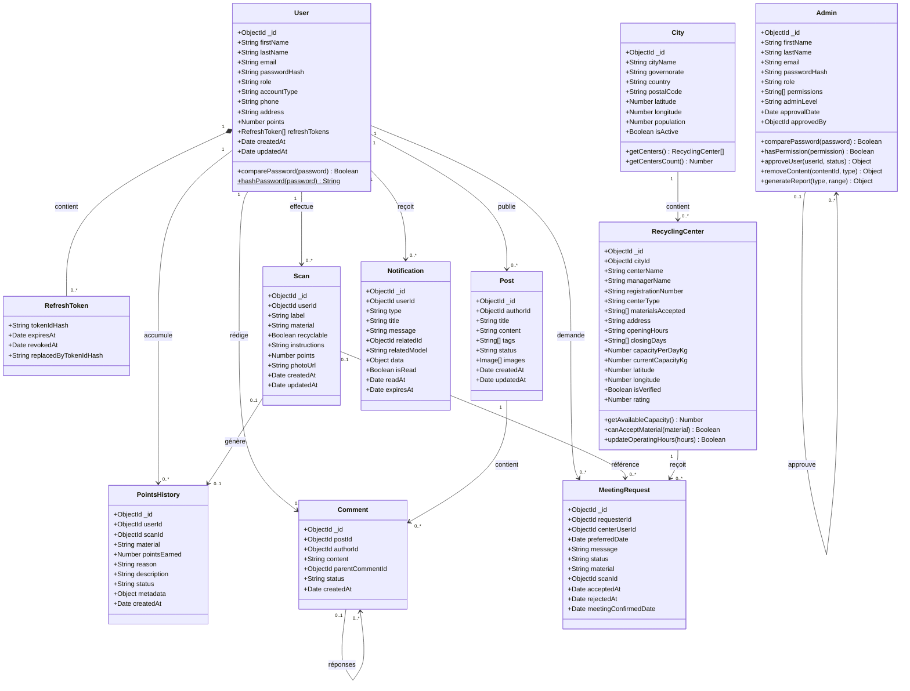

### Légende des cardinalités

| Relation | Signification |
|----------|---------------|
| User → Scan | Un utilisateur peut avoir plusieurs scans |
| User → PointsHistory | Chaque gain de points est tracé |
| Scan → PointsHistory | Un scan peut générer une entrée d'historique |
| Post → Comment | Un post a plusieurs commentaires |
| Comment → Comment | Réponses imbriquées (`parentCommentId`) |
| City → RecyclingCenter | Une ville contient plusieurs centres (`cityId`) |
| User → MeetingRequest | L'utilisateur demande un rendez-vous |
| RecyclingCenter → MeetingRequest | Le centre reçoit la demande |
| User → Notification | Destinataire des alertes système |

### Note pour draw.io

- **Ne pas** utiliser une flèche d'héritage entre `User` et `Admin`.
- `City` regroupe les centres par localisation (`cityName`, `governorate`, `country`).
- `Admin` et `RecyclingCenter` sont des **acteurs autonomes** avec authentification propre.

---

## 2. Diagramme de contexte (Chapitre 2 — Figure 7)

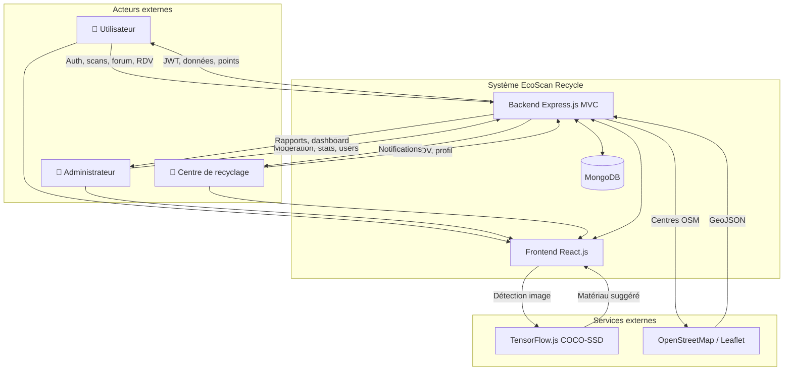

---

## 3. Diagramme de cas d'utilisation GLOBAL (Chapitre 2 — §4.3)

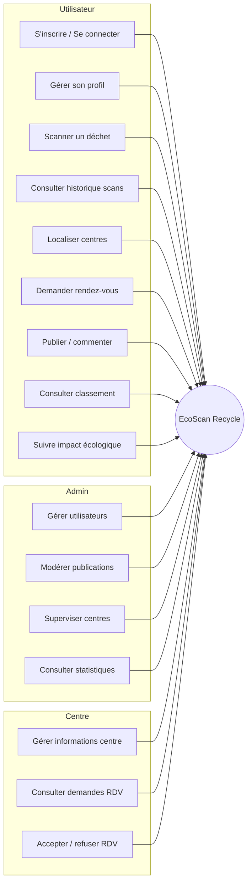

---

## 4. Diagrammes par sprint

### Sprint 1 — Authentification (Chapitre 3)

#### Classes (sous-ensemble)

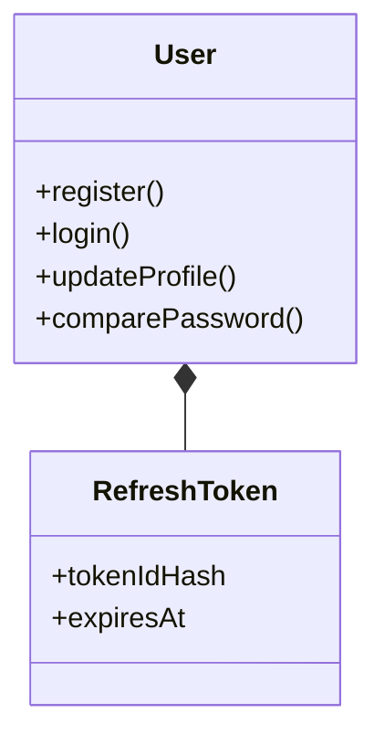

#### Séquence — S'inscrire

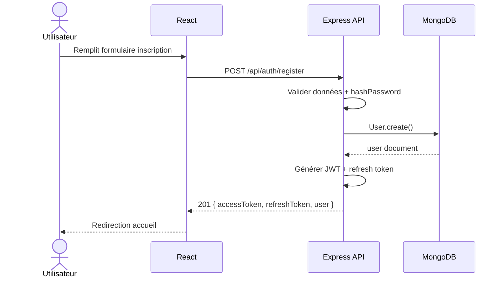

#### Séquence — Se connecter

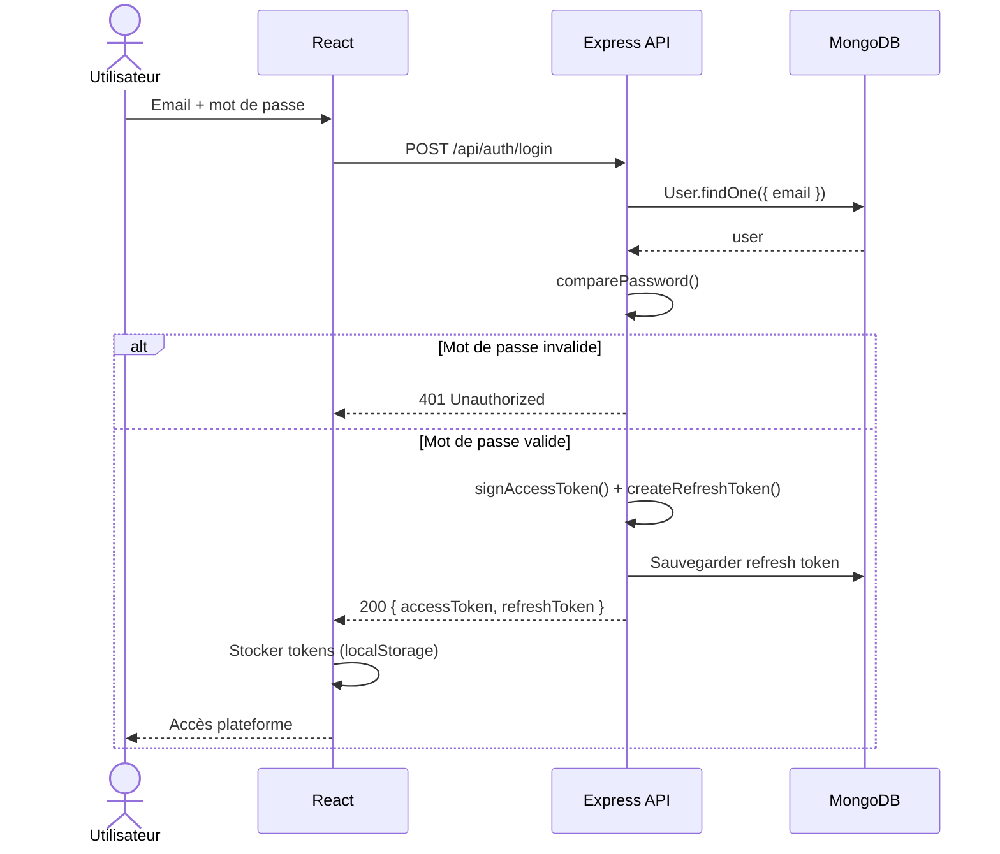

---

### Sprint 2 — Scan intelligent + Points (Chapitre 4)

#### Classes

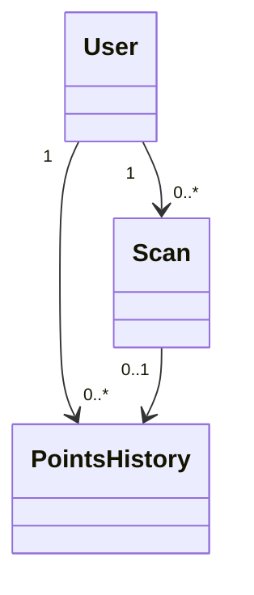

#### Cas d'utilisation raffiné

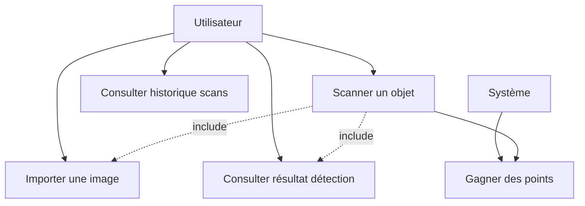

#### Activité — Scanner un objet

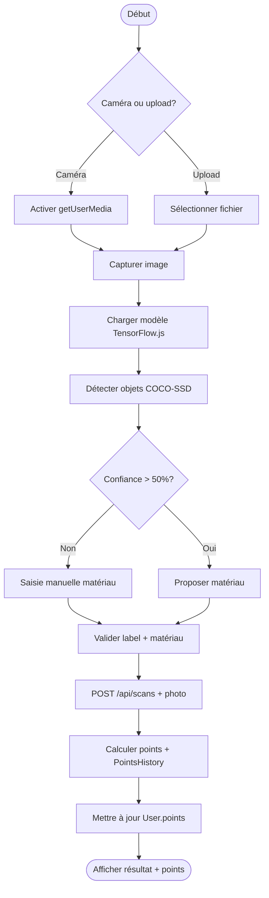

#### Séquence — Scanner un objet

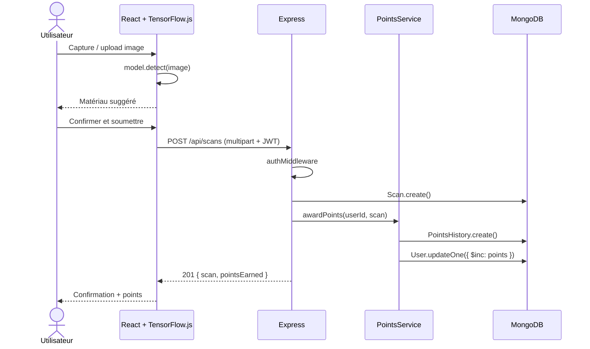

#### Séquence — Consulter historique

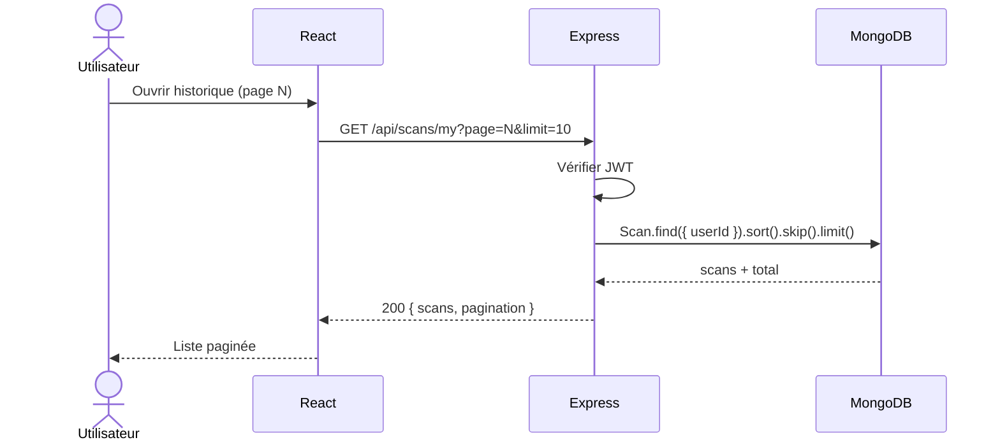

---

### Sprint 3 — Forum + Classement (Chapitre 5)

#### Classes

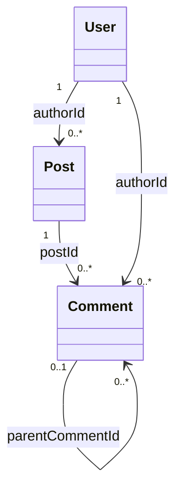

#### Activité — Créer une publication

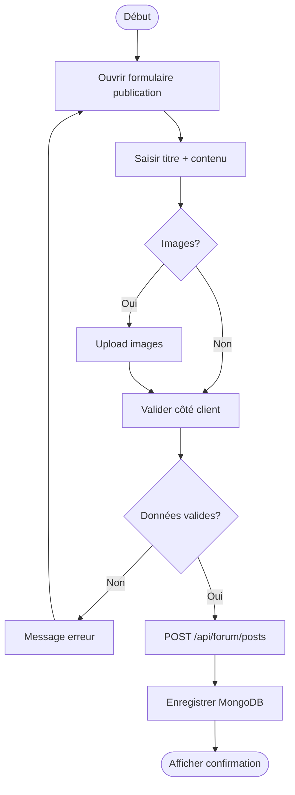

#### Séquence — Créer une publication

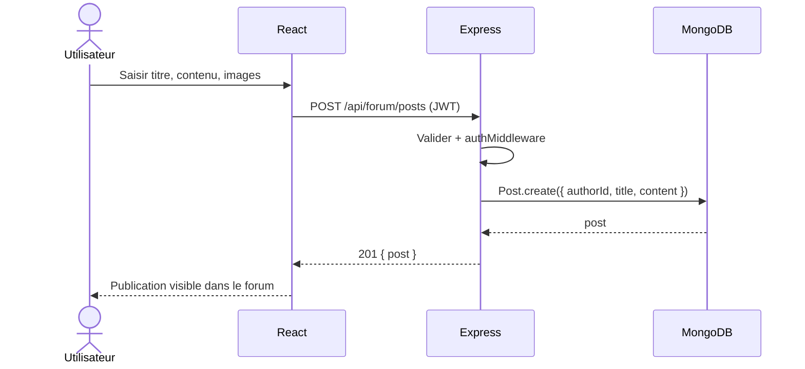

#### Séquence — Consulter le classement

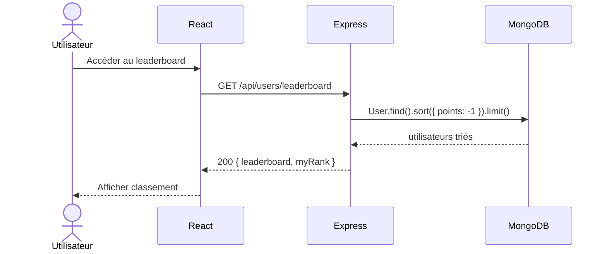

---

### Sprint 4 — Géolocalisation + Centres (Chapitre 6)

#### Classes

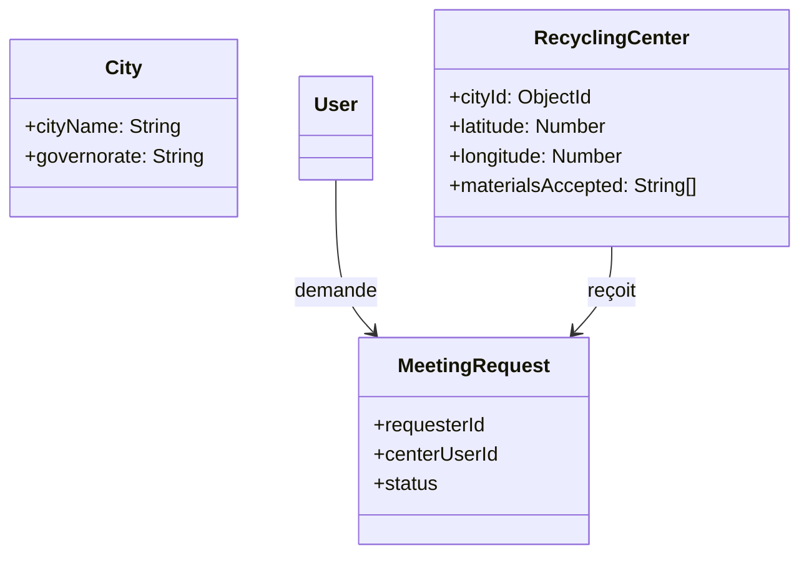

#### Activité — Rechercher centres proches

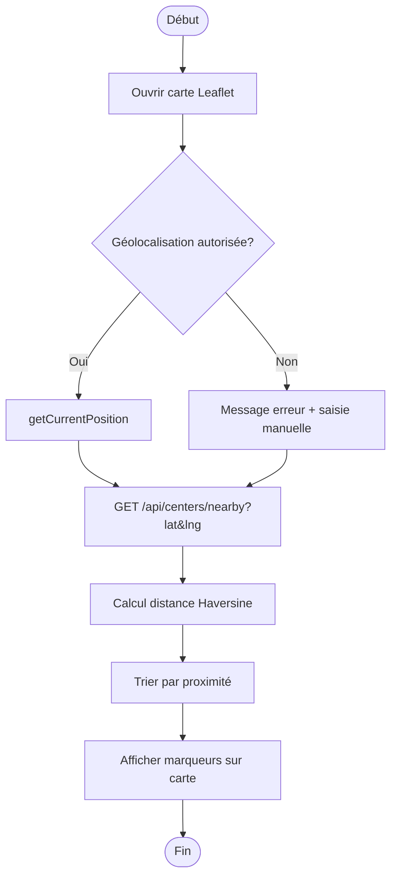

#### Séquence — Demander un rendez-vous

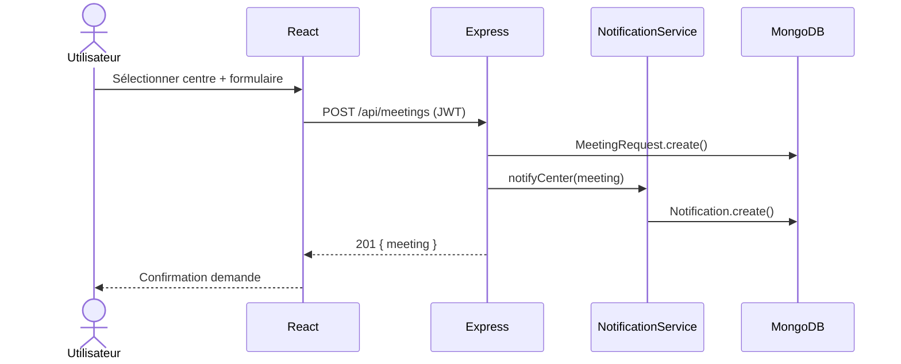

---

### Sprint 5 — Sécurité + Déploiement (Chapitre 7)

#### Classes (composants techniques)

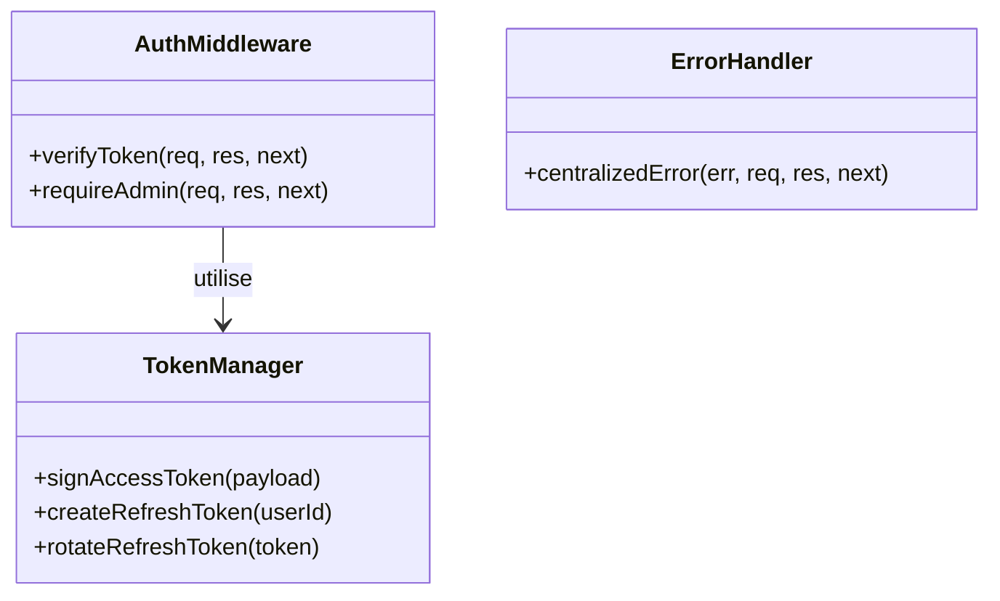

#### Séquence — Authentification sécurisée (refresh)

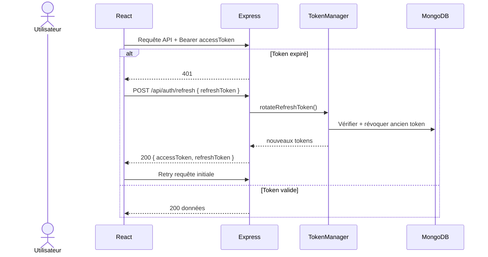

#### Séquence — Déploiement

```mermaid
sequenceDiagram
    actor A as Administrateur
    participant CI as Build / Deploy
    participant FE as Frontend (CDN/Static)
    participant BE as Backend (Node)
    participant Atlas as MongoDB Atlas

    A->>CI: npm run build (React)
    CI->>FE: Déployer fichiers statiques
    A->>CI: Déployer API Node.js
    CI->>BE: Variables .env production
    BE->>Atlas: Connexion MONGODB_URI
    Atlas-->>BE: Connexion OK
    BE-->>A: Application accessible en ligne
```

---

## 5. Architecture logicielle (Chapitre 2 — §2)

```mermaid
flowchart TB
    subgraph Client["Couche Présentation"]
        React[React.js Components]
        TF[TensorFlow.js]
        Leaf[Leaflet Map]
    end

    subgraph Serveur["Couche Contrôleur"]
        Routes[Routes Express]
        Ctrl[Controllers MVC]
        MW[Middleware auth]
        Svc[Services Points / Notifications]
    end

    subgraph Donnees["Couche Modèle"]
        Models[Mongoose Models]
        Mongo[(MongoDB)]
    end

    React --> Routes
    TF --> React
    Leaf --> React
    Routes --> MW --> Ctrl
    Ctrl --> Svc
    Ctrl --> Models
    Models --> Mongo
```

---

## 6. Architecture physique (Chapitre 2 — §2.3)

```mermaid
flowchart LR
    Browser[Navigateur Chrome]
    API[Serveur API REST Node.js]
    DB[(MongoDB Atlas)]
    CDN[CDN TensorFlow.js]
    OSM[OpenStreetMap Tiles]

    Browser -->|HTTPS JSON| API
    API -->|MongoDB Wire| DB
    Browser -->|HTTPS| CDN
    Browser -->|HTTPS| OSM
```

---

## 7. Tableau récapitulatif des figures du rapport

| Chapitre | Figure demandée | Section dans ce document |
|----------|-----------------|--------------------------|
| 2 | Diagramme de contexte | §2 |
| 2 | Architecture MVC / client-serveur | §5, §6 |
| 2 | Cas d'utilisation global | §3 |
| 3 | Classes auth | Sprint 1 — Classes |
| 3 | Séquence connexion | Sprint 1 — Séquence connecter |
| 3 | Séquence inscription | Sprint 1 — Séquence inscrire |
| 4 | Classes scan + points | Sprint 2 — Classes |
| 4 | Cas d'utilisation raffiné | Sprint 2 — CU |
| 4 | Activité scanner | Sprint 2 — Activité |
| 4 | Séquence scanner / historique | Sprint 2 — Séquences |
| 5 | Classes forum | Sprint 3 — Classes |
| 5 | Activité publication / commentaire | Sprint 3 — Activité |
| 5 | Séquences forum / leaderboard | Sprint 3 — Séquences |
| 6 | Classes géolocalisation | Sprint 4 — Classes |
| 6 | Activité recherche centres | Sprint 4 — Activité |
| 6 | Séquence RDV | Sprint 4 — Séquence |
| 7 | Classes sécurité | Sprint 5 — Classes |
| 7 | Séquence auth sécurisée / déploiement | Sprint 5 — Séquences |
| Global | **Diagramme de classes corrigé** | §1 |

---

## 8. Instructions draw.io (reproduire le diagramme de classes)

1. Créer **11 classes** : `User`, `RefreshToken`, `Admin`, `City`, `RecyclingCenter`, `Scan`, `PointsHistory`, `Post`, `Comment`, `MeetingRequest`, `Notification`.
2. Relier `City` 1 → * `RecyclingCenter` via `cityId`.
3. Relier avec associations (pas d'héritage User→Admin).
4. Cardinalités :
   - User `1` — `*` Scan  
   - User `1` — `*` PointsHistory  
   - User `1` — `*` Post, Comment, Notification, MeetingRequest  
   - Post `1` — `*` Comment  
   - Comment `0..1` — `*` Comment (réponses)  
   - City `1` — `*` RecyclingCenter  
   - RecyclingCenter `1` — `*` MeetingRequest  
   - Scan `0..1` — `0..1` PointsHistory  
5. Stéréotypes utiles : `<<enumeration>>` pour `status`, `type`, `reason`.

---

*Généré pour le rapport EcoScan Recycle — RUN-IT, stage 2026.*
